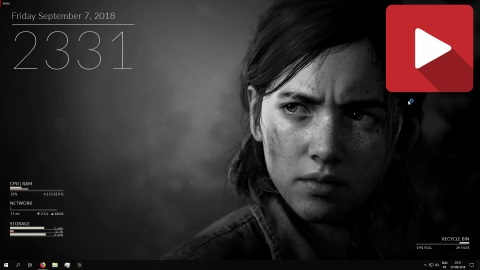

# chaRm

chaRm is a **clean**, **stylish** and **modern-looking** Rainmeter skin that aims to be as **plug and play** as possible. It essentially adds some basic but functional info as widgets on your desktop, and adapts to your wallpaper and screen resolution.
More info about Rainmeter on their [website](https://www.rainmeter.net/) or the [GitHub of the project](https://github.com/rainmeter/rainmeter).

#### Why?

My work on chaRm started after a few colleagues and friends showed interest in my old Rainmeter skin. It was a PITA to adapt my skin to each of their individual setups and background images, so I set out to create a skin that would adapt itself.
As for the name, this skin is both CHARMing and a CHAMeleon. And yes, at the beginning, I thought it was very clever.

The name of each release comes from the concatenated release number, converted to hex, inputed into [this website](https://www.colorhexa.com).
`2.1.0 -> 210 -> #0000D2 -> "Strong Red"`

# Table of Content

1. [Key Features](#1-key-features)
2. [Current Limitations](#2-current-limitations)
3. [Installation](#3-installation)
4. [Acknowledgement](#4-acknowledgement)

# 1. Key Features

### chaRm adapts to your wallpaper

Using the [chameleon 3rd party plugin by SoxTheFox](https://github.com/socks-the-fox/Chameleon), chaRm can detect the highlight colors of your wallpaper and adapt to it. It does that in real time, which means you can run a slideshow as your wallpaper, and let chaRm adapt the colors of each skins. It will even make some nice fading transitions!

### chaRm adapts to your screen resolution

Thanks to a clever use of variables throughout the theme, chaRm will sense changes in your screen resolution and adapt to it in real time. That way, whatever your screen resolution, you get the best chaRm experience !

_Due to hardware limitations, this is only tested from 800x600 up to 19020x1080. See [Current Limitaions](#current-limitations) for more information_

### chaRm is interactive

Using both tooltips and mouse actions, chaRm packs more useful information and features at your fingertips than it looks at first sight. Discover them below!

#### Storage

The `STORAGE` skin can display more information about each drive in a tootip b hovering above the relevant bar. There, you can see the name of your drive, as well as détails about its filling state. You can also left click of the bar to directly open a File Explorer window, located on the relevant drive.

Also, using [FlyingHyrax's DriveList 3rd patry plugin](https://github.com/FlyingHyrax/rm-drivelist-plugin), the list of connected drive is kept up to date in real time, and the skin will show drives accordingly up to 9 drives (support for more drive can be added quite easily)

#### RecycleBin

The `RECYCLE_BIN` skin will inform you of the state of the bin. Left clicking on it will open the File Explorer in the relevant place. You can also double left click the skin to empty your recycle bin.

#### Alerts

When some of the data under watch is going too high, chaRm will change the color of the skin to alert you. If the data is critical (like ping for example), it will choose a high impact color (default is red) to catch your attention.

# 2. Current Limitations

- chaRm is only tested on 4:3 up to 16:9 **aspect ratio**, and on 800x600 up to 1920x1080 **resolution** screens. I'm not equipped to test 21:9, 1440p or 4K
- Some **wallpapers** might not work as well as others. Usually if the general place is dark while the rest of the picture is really bright (and conversely), the text won't be readable. Some part of the skins may not be visible if the main highlight color of your wallpaper is right behind the skin. I'd say that with random wallpapers, it works out of the box more than 90% of the time. 

# 3. Installation

_TODO:UPDATE THIS SECTION_

# 4. Acknowledgements

- This project wouldn't be possible without the hard work of the [Rainmeter team](https://github.com/rainmeter/rainmeter/graphs/contributors). 
- This theme uses plugins from [FlyingHyrax](https://github.com/flyinghyrax) and [Socks the Fox](https://github.com/socks-the-fox). Thanks to both of them !
- The `STORAGE` skin uses parts of [eclectic-tech](https://forum.rainmeter.net/viewtopic.php?f=18&t=17342&p=143116&hilit=drivelist#p143116)'s work. 
- The original idea for this theme came from [Rasylver's Lines2.0 skin](<https://visualskins.com/skin/lines-20>). Although you may still find similarities in concepts, no code is shared between the two projects anymore. 
